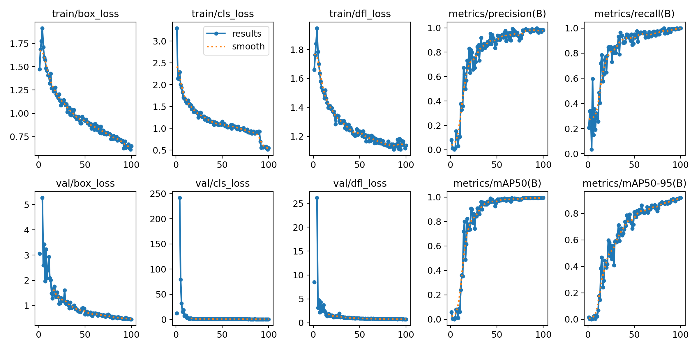
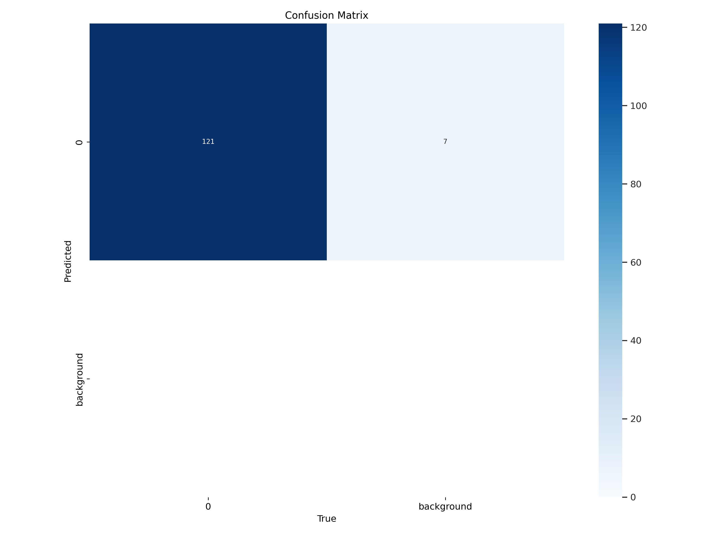

# YOLOv12 Object Detection 

This repository contains a Google Colab notebook for training and evaluating a YOLOv12 object detection model using a Roboflow dataset.

## Features
- End-to-end training pipeline
- Visualization of training metrics and results
- Interactive inference on custom images

## Sample Results

## Credits
- [YOLOv12 GitHub](https://github.com/sunsmarterjie/yolov12)
- [Roboflow Universe](https://universe.roboflow.com/)
